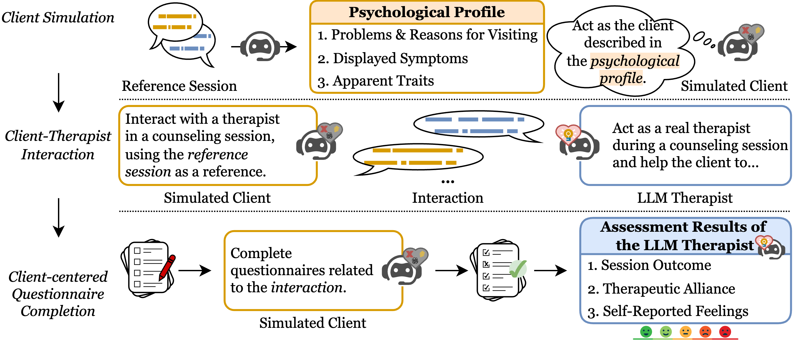

## Towards a Client-Centered Assessment of LLM Therapists by Client Simulation
[](https://opensource.org/licenses/MIT) 


This is the PyTorch implementation of the paper:

[**Towards a Client-Centered Assessment of LLM Therapists by Client Simulation**](https://arxiv.org/pdf/2406.12266). 

[Jiashuo Wang](http://www4.comp.polyu.edu.hk/~csjwang/), [Yang Xiao](https://xiaoyang66.github.io/), Yanran Li, Changhe Song, Chunpu Xu, [Chenhao Tan](https://chenhaot.com/), [Wenjie LI](https://www4.comp.polyu.edu.hk/~cswjli/)

If you use our codes or your research is related to our work, please kindly cite our paper:

```bib
@article{wang2024towards,
  title={Towards a Client-Centered Assessment of LLM Therapists by Client Simulation},
  author={Wang, Jiashuo and Xiao, Yang and Li, Yanran and Song, Changhe and Xu, Chunpu and Tan, Chenhao and Li, Wenjie},
  journal={arXiv preprint arXiv:2406.12266},
  year={2024}
}
```


## Abstract
Although there is a growing belief that LLMs
can be used as therapists, exploring LLMs’ capabilities and inefficacy, particularly from the
client’s perspective, is limited. This work focuses on a client-centered assessment of LLM
therapists with the involvement of simulated
clients, a standard approach in clinical medical education. However, there are two challenges when applying the approach to assess
LLM therapists at scale. Ethically, asking humans to frequently mimic clients and exposing
them to potentially harmful LLM outputs can
be risky and unsafe. Technically, it can be difficult to consistently compare the performances
of different LLM therapists interacting with
the same client. To this end, we adopt LLMs
to simulate clients and propose ClientCAST,
a client-centered approach to assessing LLM
therapists by client simulation. Specifically, the
simulated client is utilized to interact with LLM
therapists and complete questionnaires related
to the interaction. Based on the questionnaire
results, we assess LLM therapists from three
client-centered aspects: session outcome, therapeutic alliance, and self-reported feelings. We
conduct experiments to examine the reliability
of ClientCAST and use it to evaluate LLMs
therapists implemented by Claude-3, GPT-3.5,
LLaMA3-70B, and Mixtral 8×7B.

## Evaluation Framework
<p align="center">

</p>

